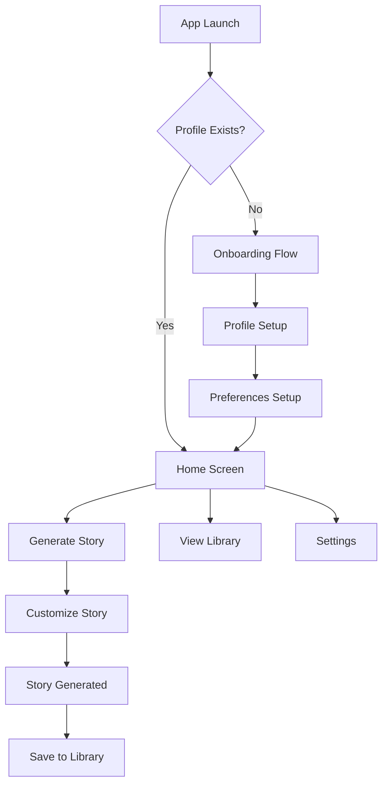

# 📚 SoftDreams

A personalized bedtime story generator iOS app that creates magical, AI-powered stories tailored to your child's interests and developmental stage.


## ✨ Features

- **🎭 Personalized Stories**: AI-generated bedtime stories customized to your child's profile, interests, and preferences
- **👶 Age-Appropriate Content**: Stories tailored to different developmental stages from pregnancy to preschooler
- **📖 Story Library**: Save and organize your child's favorite stories for repeated reading
- **🎨 Custom Themes**: Choose from various story themes, lengths, and character types
- **📱 Universal App**: Designed for both iPhone and iPad with responsive layouts

## 🏗️ Architecture

SoftDreams follows the **MVVM (Model-View-ViewModel)** architectural pattern for clean separation of concerns and maintainable code.

### Tech Stack

- **Framework**: SwiftUI
- **Language**: Swift 5.0
- **Minimum iOS Version**: 17.0
- **Data Persistence**: UserDefaults
- **Architecture Pattern**: MVVM
- **Target Devices**: iPhone & iPad

## 📁 Project Structure

```bash
SoftDreams/
├── SoftDreamsApp.swift              # Main app entry point
├── AppView.swift                   # Root view with onboarding logic
├── Models/                         # Data models
│   ├── Story.swift                # Story data structure
│   ├── StoryOptions.swift         # Story customization options
│   └── UserProfile.swift         # Child profile data
├── ViewModels/                     # MVVM view models
│   ├── HomeViewModel.swift
│   ├── LibraryViewModel.swift
│   ├── OnboardingViewModel.swift
│   ├── SettingsViewModel.swift
│   └── StoryGenerationViewModel.swift
├── Views/                          # SwiftUI views organized by feature
│   ├── Common/                    # Reusable UI components
│   ├── Home/                      # Home screen views
│   ├── Library/                   # Story library views
│   ├── Onboarding/               # User onboarding flow
│   ├── Settings/                 # App settings views
│   └── Story/                    # Story creation and viewing
└── Storage/
    └── UserDefaultsManager.swift  # Data persistence layer
```

## 🚀 Getting Started

### Prerequisites

- **Xcode 15.0+**
- **iOS 17.0+** deployment target
- **macOS 13.0+** for development
- Apple Developer Account (for device testing)

### Installation

1. **Clone the repository**

   ```bash
   git clone https://github.com/your-username/SoftDreams.git
   cd SoftDreams
   ```

2. **Open in Xcode**

   ```bash
   open SoftDreams.xcodeproj
   ```

3. **Select your development team**
   - In Xcode, select the project file
   - Go to "Signing & Capabilities"
   - Select your Apple Developer Team

4. **Build and run**
   - Select your target device or simulator
   - Press `⌘ + R` to build and run

### First Launch

1. Complete the onboarding flow to set up your child's profile
2. Customize story preferences (themes, length, characters)
3. Generate your first personalized bedtime story!

## 📱 User Flow



## 🎨 Key Features Detail

### 👶 Child Profile System

- **Multiple Stages**: Pregnancy, Newborn, Infant, Toddler, Preschooler
- **Interests Tracking**: Animals, vehicles, fairy tales, adventures, and more
- **Developmental Considerations**: Age-appropriate content and complexity

### 📚 Story Generation

- **AI-Powered**: Intelligent story creation based on profile data
- **Customizable Options**: Length, theme, character types
- **Safe Content**: Child-appropriate and educational themes

### 📖 Library Management

- **Story Saving**: Keep favorite stories for re-reading
- **Organization**: Easy browsing and story management
- **Quick Access**: Recently read and favorited stories

### 🔐 Privacy & Security

- **Content Control**: Safe, monitored story generation
- **Privacy**: Local data storage with no external sharing

## 🛠️ Development

### Code Style Guidelines

- **SwiftUI Best Practices**: Proper state management with `@StateObject`, `@ObservedObject`
- **MVVM Pattern**: ViewModels handle business logic, Views focus on UI
- **Async/Await**: Modern Swift concurrency for story generation
- **Accessibility**: VoiceOver support and child-friendly design

### Key Patterns

**ViewModel Pattern:**

```swift
class FeatureViewModel: ObservableObject {
    @Published var property: Type = defaultValue
    
    func performAction() async {
        // Business logic here
    }
}
```

**Navigation:**

```swift
.navigationDestination(isPresented: $showView) {
    DestinationView(viewModel: viewModel)
}
```

### Adding New Features

1. Create models in `Models/` folder
2. Implement ViewModels with `@Published` properties
3. Create SwiftUI views following existing patterns
4. Update `UserDefaultsManager` for persistence
5. Follow established navigation patterns

## 🧪 Testing

- Test onboarding flow completion
- Verify story generation and saving
- Test data persistence across app launches

## 🎯 Future Roadmap

- [ ] **Voice Narration**: Audio playback of generated stories
- [ ] **Story Illustrations**: AI-generated images for stories
- [ ] **Progress Tracking**: Reading habits and engagement metrics
- [ ] **Sharing Features**: Export stories to other apps
- [ ] **Multiple Languages**: International story generation
- [ ] **Advanced Customization**: More detailed story parameters

## 🤝 Contributing

We welcome contributions! Please follow these steps:

1. Fork the repository
2. Create a feature branch (`git checkout -b feature/amazing-feature`)
3. Follow the existing code style and architecture patterns
4. Test your changes thoroughly
5. Commit your changes (`git commit -m 'Add amazing feature'`)
6. Push to the branch (`git push origin feature/amazing-feature`)
7. Open a Pull Request

### Development Guidelines

- Maintain child-friendly design principles
- Follow MVVM architecture consistently
- Test on both iPhone and iPad
- Ensure accessibility compliance

## 📄 License

This project is licensed under the MIT License - see the [LICENSE](LICENSE) file for details.

## 👥 Team

- **Bundle ID**: `com.randomtech.SoftDreams`
- **Development Team**: K6GZTHQ9Z5

## 📞 Support

For support, feature requests, or bug reports, please open an issue on GitHub.

---

## **Made with ❤️ for creating magical bedtime moments**

*SoftDreams - Where every child's imagination comes to life through personalized storytelling.*
