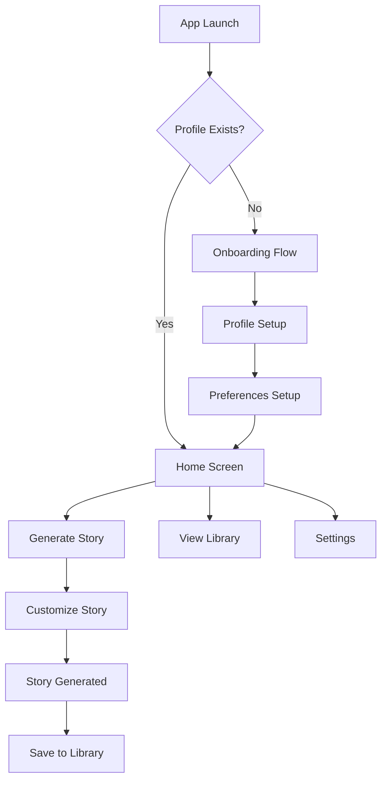

# 📚 SoftDreams

A personalized bedtime story generator iOS app that creates magical, AI-powered stories tailored to your child's interests and developmental stage.


## ✨ Features

### Core Features

- **🎭 Personalized Stories**: AI-generated bedtime stories customized to your child's profile, interests, and preferences
- **🤖 Multiple AI Models**: Support for OpenAI GPT-3.5/GPT-4 and Anthropic Claude with model selection
- **👶 Age-Appropriate Content**: Stories tailored to different developmental stages from pregnancy to preschooler
- **📖 Story Library**: CoreData-powered library to save and organize your child's favorite stories
- **🎨 Custom Themes**: Choose from various story themes, lengths, and character types
- **📱 Universal App**: Designed for both iPhone and iPad with responsive layouts

### Subscription Features

- **💰 Freemium Model**: 3 stories per day for free users, 20 stories for premium subscribers
- **🔐 Premium Benefits**: Access to advanced AI models (GPT-4, Claude), custom story settings
- **💳 StoreKit Integration**: Monthly and yearly subscription options with 7-day free trial
- **🌍 Localized Pricing**: Automatic currency and pricing localization

### Localization & Accessibility

- **🌐 Multi-Language Support**: Currently supports English and Vietnamese with easy expansion
- **🔄 Dynamic Language Switching**: Change language anytime with immediate UI updates
- **♿ Accessibility Ready**: VoiceOver support and child-friendly design patterns

### Smart Features

- **🔔 Smart Notifications**: Story time reminders and pregnancy milestone notifications
- **📊 Auto Profile Updates**: Automatic age progression and developmental milestone tracking
- **📈 Usage Analytics**: Daily story generation limits with reset tracking
- **⚙️ Theme Management**: Light, dark, and auto theme switching

## 🏗️ Architecture

SoftDreams follows the **MVVM (Model-View-ViewModel)** architectural pattern with **Test-Driven Development (TDD)** practices for clean, maintainable, and thoroughly tested code.

### Tech Stack

- **Framework**: SwiftUI
- **Language**: Swift 5.0
- **Minimum iOS Version**: 17.0
- **Data Persistence**: CoreData + UserDefaults
- **Architecture Pattern**: MVVM
- **Testing Framework**: Swift Testing
- **Development Approach**: Test-Driven Development (TDD)
- **Target Devices**: iPhone & iPad
- **AI Services**: OpenAI API, Anthropic Claude API
- **Payment Processing**: StoreKit 2
- **Notifications**: UserNotifications Framework

## 📁 Project Structure

```bash
SoftDreams/
├── SoftDreamsApp.swift              # Main app entry point with notification setup
├── AppView.swift                    # Root view with onboarding logic
├── SceneDelegate.swift              # Scene lifecycle management
├── Models/                          # Data models and business logic
│   ├── Story.swift                 # Story data structure
│   ├── StoryOptions.swift          # Story customization options
│   ├── StoryGenerationConfig.swift # Subscription and usage tracking
│   ├── SubscriptionTier.swift      # Free/Premium subscription tiers
│   ├── SubscriptionLocalization.swift # Multi-currency subscription pricing
│   ├── Language.swift              # Language selection and localization
│   ├── AIModel.swift               # AI model selection (GPT, Claude)
│   ├── ThemeMode.swift             # App theme management
│   ├── AppError.swift              # Centralized error handling
│   └── UserProfile/                # User profile models
├── ViewModels/                      # MVVM view models
│   ├── AppViewModel.swift          # App-wide state management
│   ├── HomeViewModel.swift         # Home screen logic
│   ├── LibraryViewModel.swift      # Story library management
│   ├── OnboardingViewModel.swift   # User onboarding flow
│   ├── EditProfileViewModel.swift  # Profile editing
│   ├── StoryGenerationViewModel.swift # Story creation logic
│   └── Settings/                   # Settings-related view models
├── Views/                           # SwiftUI views organized by feature
│   ├── Common/                     # Reusable UI components
│   ├── Home/                       # Home screen views
│   ├── Library/                    # Story library views
│   ├── Onboarding/                 # Multi-step onboarding flow
│   │   └── Language/               # Language selection UI
│   ├── Settings/                   # App settings and preferences
│   │   ├── EditProfile/            # Profile editing interface
│   │   ├── Notifications/          # Notification preferences
│   │   └── Preferences/            # Theme and language settings
│   ├── GenerateStory/              # Story customization and generation
│   ├── ReadingProgress/            # Reading tracking (planned)
│   └── Story/                      # Story viewing and interaction
├── Services/                        # Business logic and external integrations
│   ├── ServiceFactory.swift       # Dependency injection container
│   ├── LanguageManager.swift      # App localization management
│   ├── ThemeManager.swift         # Theme switching logic
│   ├── AutoProfileUpdateService.swift # Automatic milestone tracking
│   ├── AppInfoService.swift       # App information and versioning
│   ├── Logger.swift               # Centralized logging service
│   ├── CoreData/                   # CoreData stack and story persistence
│   │   ├── CoreDataStack.swift    # Core Data configuration
│   │   ├── CoreDataStoryService.swift # Story CRUD operations
│   │   └── StoryEntity.swift      # Core Data entity
│   ├── GenerateStory/              # AI story generation services
│   │   ├── OpenAIStoryGenerationService.swift
│   │   └── AnthropicClaudeStoryGenerationService.swift
│   ├── Notifications/              # Push notification services
│   │   ├── NotificationPermissionManager.swift
│   │   ├── DueDateNotificationService.swift
│   │   └── StoryTimeNotificationService.swift
│   ├── StoreKit/                   # Subscription management
│   │   └── StoreKitService.swift   # In-app purchase handling
│   └── UserDefaults/               # Settings and configuration persistence
│       ├── StorageKeys.swift       # Centralized storage key definitions
│       ├── UserDefaultsUserProfileService.swift
│       ├── UserDefaultsThemeService.swift
│       ├── UserDefaultsAutoUpdateSettingsService.swift
│       └── UserDefaultsStoryGenerationConfigService.swift
├── Protocols/                       # Service interfaces and protocols
│   ├── StoryGenerationServiceProtocol.swift
│   ├── StoryServiceProtocol.swift
│   ├── UserProfileServiceProtocol.swift
│   ├── NotificationPermissionManagerProtocol.swift
│   ├── StoryTimeNotificationServiceProtocol.swift
│   ├── LanguageManagerProtocol.swift
│   ├── ThemeServiceProtocol.swift
│   ├── StorageManagerProtocol.swift
│   ├── AutoProfileUpdateServiceProtocol.swift
│   └── AutoUpdateSettingsServiceProtocol.swift
├── Extensions/                      # Swift extensions
│   └── String+Extensions.swift     # Localization helpers
├── Resources/                       # App resources and localizations
│   ├── Info.plist                 # App configuration
│   ├── en.lproj/                  # English localization
│   └── vi.lproj/                  # Vietnamese localization
└── Config/                          # Build configuration
    ├── APIConfig.swift             # API keys and endpoints
    ├── Base.xcconfig               # Base build settings
    ├── Development.xcconfig        # Debug configuration
    └── StoreKit/                   # StoreKit configuration files

SoftDreamsTests/                     # Comprehensive test suite (TDD approach)
├── SoftDreamsTests.swift           # Swift Testing framework tests
├── SoftDreamsAppTests.swift        # App lifecycle and integration tests
├── Mocks/                          # Test doubles and mock services
│   └── MockServices.swift         # Mock implementations for testing
├── Services/                       # Service layer tests (placeholders for TDD)
└── ViewModels/                     # ViewModel unit tests (placeholders for TDD)
```

## 🚀 Getting Started

### Prerequisites

- **Xcode 15.0+**
- **iOS 17.0+** deployment target
- **macOS 13.0+** for development
- Apple Developer Account (for device testing and StoreKit)
- **API Keys** (for AI story generation):
  - OpenAI API key
  - Anthropic Claude API key (optional)

### Installation

1. **Clone the repository**

   ```bash
   git clone https://github.com/your-username/SoftDreams.git
   cd SoftDreams
   ```

2. **Configure API Keys**

   **Option 1: Environment Variables (Recommended)**
   Set environment variables in your development environment:

   ```bash
   export OPENAI_API_KEY="your-openai-api-key"
   export ANTHROPIC_API_KEY="your-anthropic-api-key"  # Optional
   export ANTHROPIC_API_BASE_URL="https://api.anthropic.com/v1"  # Optional
   ```

   **Option 2: Xcode Build Settings**
   Add the API keys to your Xcode build settings:
   - Select your project file in Xcode
   - Go to Build Settings → User-Defined
   - Add `OPENAI_API_KEY` with your OpenAI API key
   - Add `ANTHROPIC_API_KEY` with your Anthropic API key (optional)

   The app will automatically detect and use these keys via the `APIConfig.swift` configuration.

3. **Open in Xcode**

   ```bash
   open SoftDreams.xcodeproj
   ```

4. **Configure StoreKit Testing**
   - The project includes StoreKit configuration files for testing subscriptions
   - In Xcode scheme settings, select the appropriate `.storekit` file for testing

5. **Select your development team**
   - In Xcode, select the project file
   - Go to "Signing & Capabilities"
   - Select your Apple Developer Team

6. **Build and run**
   - Select your target device or simulator
   - Press `⌘ + R` to build and run

### First Launch

1. **Language Selection**: Choose your preferred language (English/Vietnamese)
2. **Profile Setup**: Complete the onboarding flow to set up your child's profile
3. **Notification Permissions**: Optionally enable notifications for story reminders
4. **Story Preferences**: Customize story themes, length, and characters
5. **Generate Stories**: Create your first personalized bedtime story!

### Testing

Run the comprehensive test suite:

```bash
# Run all tests
⌘ + U in Xcode

# Run specific test files
⌘ + Control + Option + U
```

The project follows **Test-Driven Development (TDD)** with:

- Unit tests for all ViewModels and Services (test placeholders ready for TDD implementation)
- Integration tests for CoreData and API services
- Comprehensive mock services in `SoftDreamsTests/Mocks/MockServices.swift`
- Swift Testing framework for modern test syntax
- Protocol-based architecture enables easy testing with dependency injection

**Current Test Structure:**

- Main app tests: `SoftDreamsTests.swift` and `SoftDreamsAppTests.swift`
- Mock services: Comprehensive mocks for all service protocols
- TDD-ready structure: Test folders prepared for ViewModels and Services testing

## 📱 User Flow



## 🎨 Key Features Detail

### 👶 Advanced Profile System

- **Multiple Development Stages**: Pregnancy, Newborn, Infant, Toddler, Preschooler
- **Automatic Progression**: Smart milestone tracking with age-based updates
- **Interest Tracking**: Animals, vehicles, fairy tales, adventures, and more
- **Developmental Considerations**: Age-appropriate content and complexity
- **Multi-Language Profiles**: Support for different language preferences

### 🤖 AI-Powered Story Generation

- **Multiple AI Models**: OpenAI GPT-3.5/GPT-4 and Anthropic Claude support
- **Model Selection**: Free users get GPT-3.5, Premium users choose advanced models
- **Intelligent Prompting**: Context-aware prompts based on child's profile
- **Customizable Options**: Story length, theme, character types, and educational focus
- **Safe Content**: Child-appropriate and educational themes with content filtering
- **Multi-Language Generation**: Stories generated in user's preferred language

### 💰 Freemium Subscription Model

- **Free Tier**: 3 stories per day with GPT-3.5 Turbo
- **Premium Tier**: 20 stories per day with access to all AI models
- **Usage Tracking**: Daily limits with automatic reset at midnight
- **StoreKit Integration**: Secure in-app purchases with receipt validation
- **Pricing Localization**: Currency and pricing adapted to user's region
- **Free Trial**: 7-day trial for premium features

### 📖 CoreData Library Management

- **Persistent Storage**: Stories saved using CoreData for offline access
- **Advanced Search**: Full-text search through story titles and content
- **Favorite System**: Mark and filter favorite stories
- **Reading Progress**: Track reading time and story completion (planned)
- **Story Organization**: Sort by date, theme, or favorite status
- **Bulk Operations**: Easy story management and cleanup

### 🔔 Smart Notification System

- **Story Time Reminders**: Customizable daily story time notifications
- **Pregnancy Milestones**: Due date reminders and milestone notifications
- **Permission Management**: Graceful permission requests with user education
- **Notification Actions**: Quick actions for profile updates and reminders
- **Localized Content**: Notifications in user's preferred language

### 🌐 Comprehensive Localization

- **Multi-Language Support**: Currently English and Vietnamese with easy expansion
- **Dynamic Language Switching**: Change language without app restart
- **Localized Content**: All UI text, notifications, and story prompts
- **Currency Adaptation**: Subscription pricing in local currency
- **Cultural Sensitivity**: AI prompts include cultural context when appropriate

### 🎨 Modern UI/UX Design

- **Child-Friendly Design**: Colorful, engaging interface suitable for families
- **Dark/Light Themes**: Automatic or manual theme switching
- **Accessibility Support**: VoiceOver compatibility and large text support
- **Responsive Design**: Optimized for both iPhone and iPad
- **Smooth Animations**: Engaging transitions and micro-interactions

## 🛠️ Development

### Test-Driven Development (TDD) Approach

SoftDreams follows **strict TDD practices** for all new features:

1. **Red Phase**: Write failing tests that define expected behavior
2. **Green Phase**: Write minimal code to make tests pass
3. **Refactor Phase**: Improve code while maintaining test coverage

**Testing Standards:**

- **Minimum 80% code coverage** for all new code
- **Unit tests** for all ViewModels, Models, and Services
- **Integration tests** for CoreData and API interactions
- **Mock services** for isolated testing in `SoftDreamsTests/Mocks/`

### Code Style Guidelines

- **SwiftUI Best Practices**: Proper state management with `@StateObject`, `@ObservedObject`
- **MVVM Pattern**: ViewModels handle business logic, Views focus on UI
- **Async/Await**: Modern Swift concurrency for all async operations
- **Protocol-Oriented**: Services defined by protocols for testability
- **Dependency Injection**: ServiceFactory pattern for clean architecture
- **Accessibility**: VoiceOver support and child-friendly design

### Key Design Patterns

**ViewModel Pattern:**

```swift
class FeatureViewModel: ObservableObject {
    @Published var property: Type = defaultValue
    
    func performAction() async {
        // Business logic here
    }
}
```

**Service Protocol Pattern:**

```swift
protocol ServiceProtocol {
    func performOperation() async throws -> Result
}

class RealService: ServiceProtocol {
    func performOperation() async throws -> Result {
        // Implementation
    }
}
```

**Async Story Generation:**

```swift
Task {
    await viewModel.generateStory(profile: profile, options: options)
    // Update UI state
}
```

**Navigation:**

```swift
.navigationDestination(isPresented: $showView) {
    DestinationView(viewModel: viewModel)
}
```

### Component Organization

- **Feature-specific components**: Place in `Views/[Feature]/Components/`
- **Reusable components**: Place in `Views/Common/`
- **Service implementations**: Organized by category in `Services/`
- **Test mocks**: Centralized in `SoftDreamsTests/Mocks/`

## 🧪 Testing

The project implements **Test-Driven Development (TDD)** practices:

- **Comprehensive Test Structure**: Ready for full TDD implementation
- **Mock Services**: Complete mock implementations for all service protocols
- **Protocol-Based Testing**: Easy dependency injection for isolated unit tests
- **Integration Test Setup**: Ready for CoreData and API testing
- **Swift Testing Framework**: Modern testing with `@Test` attributes

### Running Tests

```bash
# Run all tests in Xcode
⌘ + U

# Run specific test files
⌘ + Control + Option + U
```

### Test Coverage Goals

- **Minimum 80% code coverage** for all new code
- **Unit tests** for all ViewModels, Models, and Services  
- **Integration tests** for data persistence and API interactions
- **UI tests** for critical user flows (onboarding, story generation)

## 🎯 Current Status & Roadmap

### ✅ Implemented Features

- **Complete Onboarding Flow**: Multi-step profile setup with language selection
- **AI Story Generation**: OpenAI GPT-3.5/GPT-4 and Anthropic Claude integration
- **CoreData Library**: Persistent story storage with full CRUD operations
- **Subscription System**: StoreKit integration with freemium model
- **Multi-Language Support**: English and Vietnamese with dynamic switching
- **Theme Management**: Light/dark/auto theme switching
- **Smart Notifications**: Story time reminders and pregnancy milestones
- **Auto Profile Updates**: Age progression and milestone tracking
- **Comprehensive Architecture**: MVVM with protocol-based dependency injection
- **TDD Infrastructure**: Mock services and test structure in place

### 🚧 In Development

- **Comprehensive Unit Tests**: TDD implementation for all ViewModels and Services
- **UI Integration Tests**: Critical user flow testing
- **Error Handling Enhancement**: More robust error recovery

### 📋 Future Roadmap

- [ ] **Voice Narration**: Audio playback of generated stories
- [ ] **Story Illustrations**: AI-generated images for stories  
- [ ] **Reading Progress Tracking**: Enhanced engagement metrics
- [ ] **Sharing Features**: Export stories to other apps
- [ ] **Additional Languages**: Expanded international support
- [ ] **Advanced Story Customization**: More detailed story parameters
- [ ] **Gemini AI Integration**: Google's Gemini as third AI option

## 🤝 Contributing

We welcome contributions! Please follow these steps:

1. Fork the repository
2. Create a feature branch (`git checkout -b feature/amazing-feature`)
3. Follow the existing code style and architecture patterns
4. Test your changes thoroughly
5. Commit your changes (`git commit -m 'Add amazing feature'`)
6. Push to the branch (`git push origin feature/amazing-feature`)
7. Open a Pull Request

### Development Guidelines

- Maintain child-friendly design principles
- Follow MVVM architecture consistently
- Test on both iPhone and iPad
- Ensure accessibility compliance

## 📄 License

This project is licensed under the MIT License - see the [LICENSE](LICENSE) file for details.

## 👥 Team

- **Bundle ID**: `com.randomtech.SoftDreams`
- **Development Team**: K6GZTHQ9Z5

## 📞 Support

For support, feature requests, or bug reports, please open an issue on GitHub.

---

## **Made with ❤️ for creating magical bedtime moments**

*SoftDreams - Where every child's imagination comes to life through personalized storytelling.*
